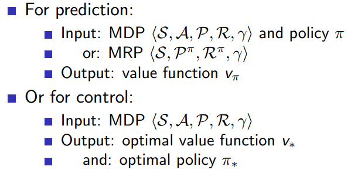
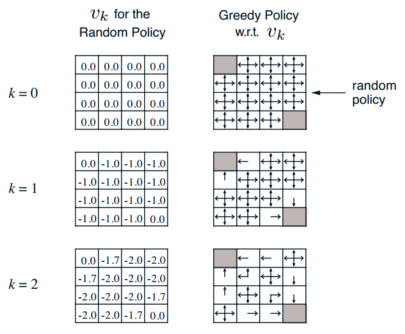
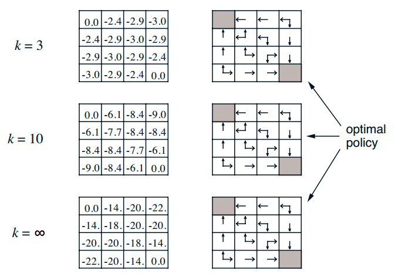
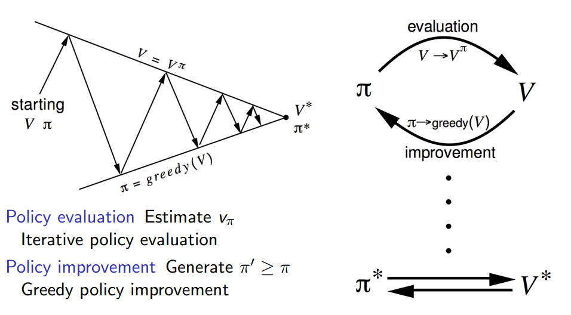
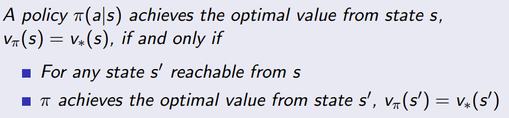
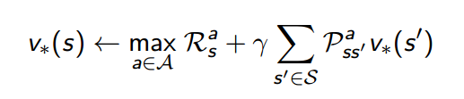

## Dynamic Programming

### 应用场景

当问题具有以下两个特性时，可以考虑用动态规划求解

- 复杂问题的最优解由数个子问题的最优解构成，也即可以通过寻找子问题的最优解来得到原问题的最优解；
- 子问题在复杂问题的求解中反复出现，也就是说可以将子问题的解存储起来以重复利用（以空间换时间）

MDP具有上述特性：Bellman方程将问题递归分解为子问题；而价值函数存储了子问题的解，可以复用。

DP需要full knowledge of an MDP（包括状态行为空间、状态转移矩阵、奖励等），是用于planning的方法，与典型的强化学习问题有所不同。DP可以用于预测和控制。

### Iterative policy evaluation

**问题：**评估一个给定的策略π，也就是解决**预测**问题

**解决方案：**反向迭代应用Bellman期望方程

**具体方法：同步反向迭代**

$$
\boldsymbol{v}^{k+1}=\boldsymbol{\mathcal{R}}^\pi+\gamma\boldsymbol{\mathcal{P}}^\pi\boldsymbol{v}^k,v_{k+1}(s)=\sum\limits_{a\in\mathcal{A}}\pi(a|s)\left(\mathcal{R}_s^a+\gamma\sum\limits_{s'\in\mathcal{S}}\mathcal{P}_{ss'}^av_k(s')\right)
$$

第$k+1$次迭代时，状态s的价值等于该状态的即时奖励与所有s的下一个可能状态s' 的第$k$次迭代中的价值与其概率乘积的和。

一开始可以将所有状态的价值都初始化为0，之后不断同步迭代更新，直到状态价值函数收敛。输出$v_\pi$

### policy iteration

改善策略的方法（解决**控制**问题）：首先给定一个策略（可以初始化为随机策略），计算$v_\pi$（iterative policy evaluation），根据v值**贪婪**地更新策略，重新计算$v_\pi$，反复多次，最终得到最优策略$\pi^*$和最优状态价值函数$V^*$.

这里**贪婪**是指仅采取那些使得状态价值最大的行为，参考上面***方格世界***的例子。

**理论证明**

采用贪婪算法改善策略至少提高了**一步**的价值。贪婪算法之所以能奏效是因为value function描述的是长期价值.

### Value iteration

最优策略可以分解为两部分：在当前状态采取最优行为；在下一状态遵循最优策略。

**定理：**一个策略能够使得状态s获得最优价值，当且仅当：对于从状态s可以到达的任何状态s’，该策略能够使得状态s’的价值是最优价值。

- deterministic value iteration

  如果知道子问题的解，也即$v_*(s')$，那么通过one-step lookahead就能找到当前问题的解$v_*(s)$

​		直觉上我们可以从最终目标状态出发，应用上述公式逐步反向递推。

当不确定最终状态时，我们仍可以应用价值迭代（value iteration）找到最优策略。

- value iteration

  **问题：**找到最优策略$\pi^*$

  **解决方案：**迭代应用Bellman optimal equation

  **具体方法**与policy iteration类似，仍然是同步更新所有状态（根据每一个状态的最优后续状态价值来更新该状态的最佳状态价值），第$k+1$轮迭代更新$v_{k+1}(s)$依赖第$k$轮迭代$v_k(s')$的值。

  value iteration和policy iteration的区别在于递推方程，value iteration使用的是Bellman optimal equation，而policy iteration使用的是Bellman expected equation

DP扩展

- 异步动态规划asynchronous dynamic programming
  - 原位动态规划in-place dynamic programming
  - 重要状态优先更新prioritised sweeping
  - 实时动态规划real-time dynamic programming
- sample backups
- Approximate Dynamic Programming  

