## Markov Decision Process

[TOC]

### Markov Process

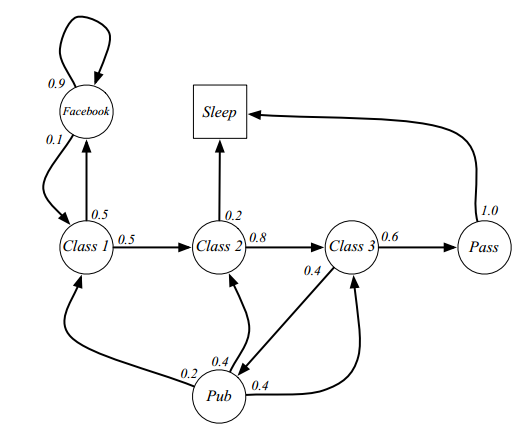

MDPs describe an environment for reinforcement learning, and the environment is fully observable.

几乎所有的RL问题都能形成MDPs，部分可观测问题也能转化为MDPs

A state $S_t$ is Markov if and only if
$$
\mathbb{P}[S_{t+1}|S_t]=\mathbb{P}\left[S_{t+1}|S_1,...,S_t\right]
$$

对于Markov状态s和它的接续状态s'，状态转移概率（state transition probability）定义为
$$
\mathcal{P}_{ss'}=\mathbb{P}[S_{t+1}=s'|S_t=s]
$$
状态转移矩阵中每个元素都定义了从一个状态转移到另一个状态的概率是多少
$$
\mathcal{P}=\begin{bmatrix}\mathcal{P}_{11}&\cdots&\mathcal{P}_{1n}\\\vdots\\\mathcal{P}_{n1}&\cdots&\mathcal{P}_{nn}\end{bmatrix}
$$
马尔科夫过程是无记忆的随机过程，马尔科夫过程（或者说马尔科夫链）是一个tuple $\left<\mathcal{S},\mathcal{P}\right>$

### Markov Reward Process

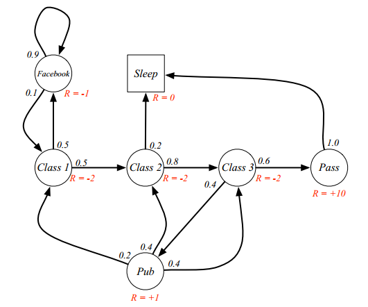

A Markov reward process is a Markov chain with values, is a tuple $\left<\mathcal{S},\mathcal{P},\color{Red}\mathcal{R},\gamma\right>$

集合$\mathcal{R}$中的元素$R_t$对应t时刻的收益（reward），$\gamma\in[0,1]$，称为折扣率（discount），决定了未来收益的现值。回报$G_t$是t时刻的折后回报
$$
G_t =R_{t+1}+\gamma R_{t+2}+...=\sum_{k=1}^\infty\gamma^kR_{t+k+1}
$$

价值函数v(s)是状态s的长期价值，MRP中state s的价值函数是从state 是开始的回报$G_t$的期望
$$
v(s)=\mathbb{E}[G_t|S_t=s]=\mathbb{E}[R_{t+1}+\gamma R_{t+2}+...|S_t=s]\\=\mathbb{E}[R_{t+1}+\gamma G_{t+1}|S_t = s]\\=\mathbb{E}[R_{t+1}+\gamma v(S_{t+1})|S_t=s]
$$
最后一个等式的依据是，回报$G_t$的期望等于回报$G_t$期望的期望。$v(s)$包括两部分，一是该状态的即时奖励期望，即时奖励期望等于即时奖励，因为根据即时奖励的定义，它与下一个状态无关；另一个是下一时刻状态的价值期望，可以根据下一时刻状态的概率分布得到其期望。也就是说，$v(s)=\mathcal{R}_s+\gamma\sum\limits_{s'\in\mathcal{S}}\mathcal{P}_{ss'}v(s')$，其中$s'$表示状态$s$下一时刻任一可能的状态。

#### ***Bellman Equation***

$$
v(s)=\mathbb{E}[R_{t+1}+\gamma v(S_{t+1})|S_t=s]=\mathcal{R}_s+\gamma\sum\limits_{s'\in\mathcal{S}}\mathcal{P}_{ss'}v(s')
$$
用矩阵表示为$\mathcal{v}=\mathcal{R}+\gamma\mathcal{P}\mathcal{v}$，线性等式，可以直接求解$v=(I-\gamma\mathcal{P})^{-1}\mathcal{R}$

#### 区分几个重要概念

- reward $(R_t)$

  $R$是一个奖励函数。$S$状态下的奖励是某一时刻$(t)$处在状态$s$下在下一个时刻$(t+1)$能获得的奖励期望，理解为离开状态时才能获得奖励。$\mathcal{R}_s=\mathbb{E}[R_{t+1}|S_t=s]$，对应的是Markov Reward Process

- discounted return $(G_t)$

  $G_t$为在一个马尔科夫奖励链上从$t$时刻开始往后所有的奖励的折后回报，其中$\gamma$是折扣率。针对的是**某条**马尔科夫链的**某一状态**而言的。

- value function $v(s)$

  MRP中某一状态的**价值函数**为**从该状态开始**的马尔可夫链折扣回报$(G_t )$的期望。注意和$G_t$区分：从某一状态$S_t=s$出发很可能有多条马尔科夫链，$G_t$与马尔科夫链的选取有关，而价值函数是从该状态出发，所有马尔科夫链折扣回报的期望。$v(s)$与$\gamma$有关。
  
  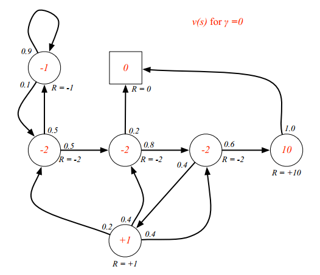
  
  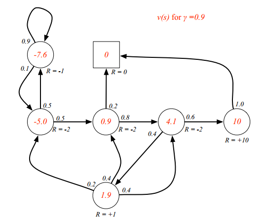

### Markov Decision Process

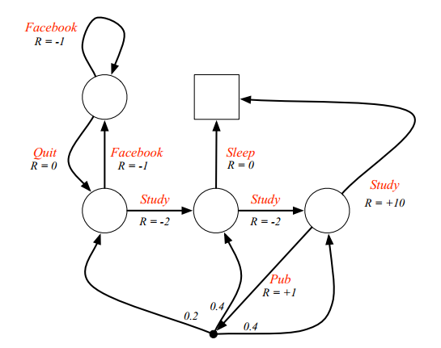

A Markov decision process is a Markov reward process with decisions. It is an environment in which all states are Markov. MDP is a tuple $\left<\mathcal{S},{\color{Red}\mathcal{A},}\mathcal{P},\mathcal{R},\gamma\right>$

注意和MRP区分，在MDP中，reward不单单取决于state，对于同一个state，采取不同的action时，得到的reward也不同。空心圆圈对应state，agent在处于空心圆圈的state时，可以**主动**采取action进入下一个state，而不像MRP那样用概率表示。而图中的黑色实点则表示一个临时state，agent可以选择action**主动**进入一个临时state，比如选择图中的“Pub”这一动作后，agent将进入一个临时state，而后**被动**由环境按照其动力学按照一定概率分配到三个state中的一个，这代表了环境中agent无法控制的因素。事实上，可以认为agent采取action后都是进入一个临时state，只不过进入该临时state后，环境只能将agent分配到唯一一个state，比如选择study，可以认为在study对应的箭头上也有一个小黑点，只不过前往下一个state的概率是1。

状态转移概率也发生了变化：$\mathcal{P}_{ss'}^a=\mathbb{P}[S_{t+1}=s'|S_t=s,A_t=a],\mathcal{P}_{ss'}^\pi=\sum\limits_{a\in\mathcal{A}}\pi(a|s)\mathcal{P}_{ss'}^a $

理解为，在执行策略 $$\pi $$ 时，状态从s转移至 s' 的概率等于一系列概率的和，这一系列概率指的是在执行当前策略时，执行某一个行为的概率与该行为能使状态从s转移至s’的概率的乘积

$\mathcal{R}$是reward function，其中，$\mathcal{R}_s^a=\mathbb{E}[R_{t+1}|S_t=s,A_t=a]$

A policy $\pi$ is a distribution over actions given states
$$
\pi(a|s)=\mathbb{P}(A_t=a|S_t=s)
$$
一个策略$\pi$完整定义了agent的行为方式，即定义了agent在各个state下各种可能的action以及其概率大小。$\pi(a|s)$只代表agent处于状态s时采取动作a的概率，而策略$\pi$包含所有的state以及对应的所有可能的action，是一个整体的概念，不随状态改变而改变。在MDP中，policy只和当前状态有关，与历史信息无关。而且某一确定的policy是静态的，与时间无关，不过agent可以随着时间推移更新policy（如动态规划）。

#### 状态价值函数和行为价值函数

The state-value function $v_\pi(s)$ of an MDP is the **expected** return starting from state s, and the following policy $\pi$
$$
v_\pi(s)=\mathbb{E}_\pi[G_t|S_t = s]
$$
指的是在MDP下的基于策略π的**状态价值函数**，表示从状态s开始，**遵循当前策略**时所获得的收获的期望；或者说在执行当前策略π时，衡量个体处在状态s时的价值大小。

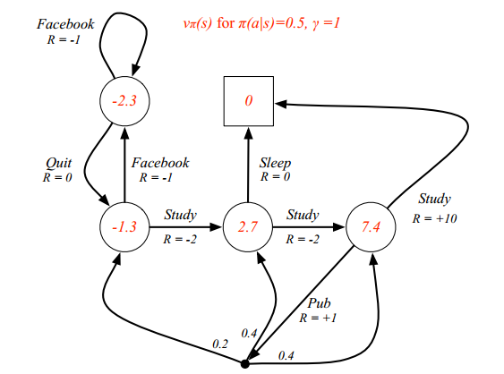

The action-value function $q_\pi(s,a)$ is the expected return starting from state s, taking action a, and then following policy $\pi $
$$
q_\pi(s,a)=\mathbb{E}_\pi[G_t|S_t=s,A_t=a]
$$
**表示**在执行策略π时，对当前状态s执行某一具体行为a所能得到的收获的期望；或者说在遵循当前策略$\pi$时，衡量对当前状态执行行为a的价值大小。行为价值函数一般都是与某一特定的状态相对应，更精细的描述是**状态行为对**价值函数

#### ***Bellman Expectation Equation***

$$
v_\pi(s)=\mathbb{E}_\pi[R_t+\gamma v_\pi(S_{t+1})|S_t = s]; \\q_\pi(s,a)=\mathbb{E}_\pi[R_t+\gamma q_\pi(S_{t+1},A_{t+1})|S_t=s,A_t=a]
$$

写成矩阵形式后，$v_\pi=\mathcal{R}^\pi+\gamma\mathcal{P}^\pi v_\pi\Rightarrow v_\pi=(I-\gamma\mathcal{P}^\pi)^{-1}\mathcal{R}^\pi$

**$v_\pi(s) $和$q_\pi(s,a) $的关系**

| 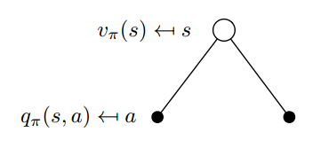 | 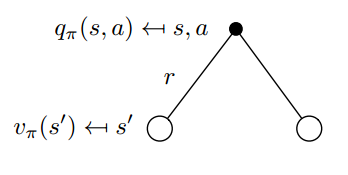 |
| ------------------------------------------------------------ | ------------------------------------------------------------ |
| 
 $v_\pi(s)=\sum\limits_{a\in\mathcal{A}}\pi(a|s)q_\pi(s,a) $ | 
 $q_\pi(s,a)=\mathcal{R}_s^a+\gamma\sum\limits_{s'\in\mathcal{S}}\mathcal{P}_{ss'}^av_\pi(s')$ |
| 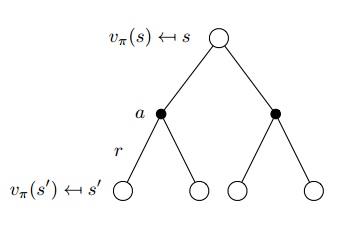 | 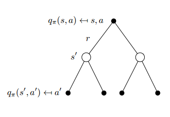 |
| 
 $v_\pi(s)=\sum\limits_{a\in\mathcal{A}}\pi(a|s)\left(\mathcal{R}_s^a+\gamma\sum\limits_{s'\in\mathcal{S}}\mathcal{P}_{ss'}^av_\pi(s')\right) $ | 
 $q_\pi(s,a)=\mathcal{R}_s^a+\gamma\sum\limits_{s'\in\mathcal{S}}\mathcal{P}_{ss'}^a\sum\limits_{a'\in\mathcal{A}}\pi(a'|s')q_\pi(s',a')$ |

#### 最优价值函数

最优状态价值函数指的是从所有策略产生的状态价值函数$v_\pi(s)$中选取使状态s价值最大的函数，即

$$
v_*(s)=\max\limits_\pi v_\pi(s)
$$

类似的，最优行为价值函数指的是从所有策略产生的行为价值函数中，选取**状态行为对**$<s,a>$价值最大的函数，即
$$
q_*(s,a)=\max\limits_\pi q_\pi(s,a)
$$

最优价值函数明确了MDP的最优可能表现，当我们知道了最优价值函数，也就知道了每个状态的最优价值，这时便认为这个MDP解决了。我们可以通过最大化最优行为价值函数来找到最优策略。

#### 最优策略

当对于任何状态 s，遵循策略π的价值不小于遵循策略 π' 下的价值，则策略π优于策略 π’，即
$$
\pi\ge\pi', if\ v_\pi(s)\ge v_{\pi'}(s), \forall s
$$

**定理** 对于任何MDP，下面几点成立：

- 1.存在一个最优策略，比任何其他策略更好或至少相等；
- 2.所有的最优策略有相同的最优价值函数；
- 3.所有的最优策略具有相同的行为价值函数.

#### ***Bellman Optimally Equation***

一个状态的最优价值等于从该状态出发采取的所有行为产生的行为价值中最大的那个行为价值，即

$$
v_*(s)=\max\limits_a q_*(s,a)
$$

在某个状态s下，采取某个行为的最优价值由2部分组成，一部分是离开状态s的即刻奖励，另一部分则是所有能到达的状态s’的最优状态价值按出现概率求和，即
$$
q_*(s,a)=\mathcal{R}_s^a+\gamma\sum_{s'\in\mathcal{S}}\mathcal{P}_{ss'}^av_*(s')
$$
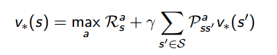

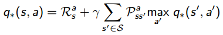

贝尔曼最优方程是非线性的（引入了$\max$），通常来说无法解析求解，只能通过迭代的方法求解

- Value Iteration
- Policy Iteration
- Q-learning
- Sarsa

