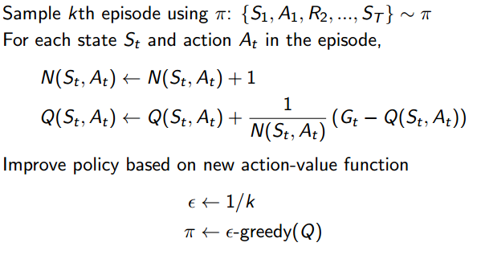

## Model-Free Control

prediction只是对一个策略的价值函数做评估，而control的目标是优化价值函数和策略。model-free control的方法适用于两类场景：

- 模型运行机制未知，但是我们可以去经历、去尝试；
- 虽然问题模型是已知的，但问题的规模太大以至于计算机无法高效的计算，除非使用采样的办法

根据优化控制过程中**是否利用已有或他人的经验策略来改进我们自身的控制策略**，我们可以将这种优化控制分为两类：On-policy Learning和Off-policy Learning

[TOC]

### On-policy Monte-Carlo Control

使用的主要思想仍是**动态规划**的思想，即在**策略评估**和**贪婪改善策略**这两个交替的过程中不断优化价值函数和策略，直至收敛。不过动态规划在更新策略时依赖MDP模型，$\pi'(s)=\arg\max\limits_{a\in\mathcal{A}}\mathcal{R}_s^a+\mathcal{P}_{ss'}^aV(s')$。而在Model-Free Control问题中，我们无法知道当前状态的所有后续状态，也就无法确定在当前状态下采取怎样的行为更合适。为解决这一问题，使用**状态行为对**价值函数$Q(s,a)$代替$V(s)$，$\pi'(s)=\arg\max\limits_{a\in\mathcal{A}} Q(s,a)$，这时是model-free的，也就是说不知道整个模型也可以改善策略，只需要知道在某个状态下采取什么什么样的行为价值最大即可。

- **策略评估**可以采用上一章Model-Free Prediction中的Monte-Carlo Learning算法，不过评估对象不再是状态价值函数$V=v_\pi $，而是**状态行为对**价值函数$Q=q_\pi $；

- DP中的**贪婪改善策略**直接应用到model-free control上同样有问题，DP中我们掌握了整个状态行为空间的信息，但在model-free的场景里，我们只能采样到一部分，如果我们每次都使用贪婪算法来改善策略的时候，将很有可能由于没有足够的采样经验而导致产生一个并不是最优的策略。因此我们需要不时的尝试一些新的行为，也就是探索（Exploration）。Greedy policy improvement需要调整为$\epsilon$-Greedy exploration，使得某一状态下所有可能的行为都有一定非零几率被选中执行，以保证持续探索所有可能性。有$1-\epsilon$的概率下选择当前认为最好的行为（仍然是贪婪的），剩下$\epsilon$的概率在所有可能的行为中随机选择一个，当然所有可能的行为也包括了最好的行为。注意以下式子中，选择最好的行为的概率并不是$1-\epsilon$，而是$\boldsymbol{\epsilon/m+}1-\epsilon$，具体地：

  

  但采用这种方法我们最终只能得到基于某一策略下的近似Ｑ函数，且该算法没没有一个终止条件，因为它一直在进行探索。我们需要关注以下两个方面：一方面我们不想丢掉任何更好信息和状态，另一方面随着我们策略的改善我们最终希望能终止于某一个最优策略，因为事实上最优策略不应该包括一些随机行为选择。为此引入了另一个理论概念：**GLIE**。

  - **GLIE**(Greedy in the Limit with Infinite Exploration)，直白的说是在有限的时间内进行无限可能的探索。具体表现为：所有已经经历的状态行为对（state-action pair）会被无限次探索；另外随着探索的无限延伸，贪婪算法中$\epsilon $值趋向于０。例如取$\epsilon=1/k$，$k$为探索过的Episode的数目。

#### GLIE Monte-Carlo Control

**定理：**GLIE Monte-Carlo Control最终能收敛到最优状态行为价值函数，即$Q(s,a)\rightarrow q_*(s,a)$

### On-Policy Temporal-Difference Control

#### SARSA

命名来源：如下图所示，针对一个状态$S$和一个特定的行为$A$，得到一个**状态行为对**$\left<S,A\right>$，与环境交互后得到即时奖励$R$，以及后续状态$S'$。之后个体将遵循**当前策略**产生行为$A'$，根据当前的**状态行为价值函数**得到后一个状态行为对$\left<S',A'\right>$的价值$Q$，利用该$Q$值更新前一个**状态行为对**$\left<S,A\right>$的价值。
$$
Q(S,A)\leftarrow Q(S,A)+\alpha(R+\gamma Q(S',A')-Q(S,A))
$$

值得注意的是，当agent处于$S'$时，根据**当前策略**继续产生行为$A'$后，**并不立刻执行该行为**（留到下一个循环才执行），而只是为了获取此时的状态行为对价值函数$Q(S',A')$，以便更新$Q(S,A)$，与MC Control不同的是，Sarsa采用的是一步一更新。算法中$Q(S,A)$需要用很大的表格存储起来，不适用于解决规模很大的问题。

| On-Policy Control With Sarsa                                 | Algorithm                                                    |
| ------------------------------------------------------------ | ------------------------------------------------------------ |
|  |  |

**定理：**满足如下两个条件时，Sarsa算法将收敛至最优行为价值函数

- 任何时候的策略$\pi_t(a|s)$满足GLIE特性；
- 步长$\alpha_t$的序列满足$\sum\limits_{t=1}^\infty\alpha_t=\infty$且$\sum\limits_{t=1}^\infty\alpha_t^2<\infty$.

 

#### Sarsa(λ)

##### n-Step Sarsa

和n-step TD类似，只不过评估对象不再是$V(s)$，而是$Q(s)$，定义n-step Q-return为
$$
q_t^{(n)}=R_{t+1}+\gamma R_{t+2}+\dots+\gamma^{n-1}R_{t+n}+\gamma^n Q(S_{t+n})
$$
n-step Sarsa使用n-step Q-return更新$Q(s,a)$，即
$$
Q(S_t,A_t)\leftarrow Q(S_t,A_t)+\alpha(q_t^{(n)}-Q(S_t,A_t))
$$

##### Forward View Sarsa(λ)

类似TD(λ)，通过权重系数$(1-\lambda)\lambda^{n-1}$将所有的n-step Q-return $q_t^{(n)}$结合起来，$q_t^\lambda=(1-\lambda)\sum\limits_{n=1}^\infty\lambda^{n-1}q_t^{(n)}$.

此时，更新公式为
$$
Q(S_t,A_t)\leftarrow Q(S_t,A_t)+\alpha(q_t^\lambda-Q(S_t,A_t))
$$

##### Backward View Sarsa(λ)

类似TD(λ)，这里同样引入***eligibility trace***，只不过这次针对的是**状态行为对**，在Sarsa(λ)中，每个**状态行为对**都有一个对应的***eligibility trace***，即
$$
E_0(s,a)=0\\E_t(s,a)=\gamma\lambda E_{t-1}(s,a)+\boldsymbol{1}(S_t=s,A_t=a)
$$
体现的是一个结果与某一个状态行为对的因果关系，与得到结果最近的状态行为对，以及那些在此之前频繁发生的状态行为对对得到这个结果的影响最大。

引入ET概念后，Sarsa(λ)的Q值更新公式为
$$
\delta_t=R_{t+1}+\gamma Q(S_{t+1},A_{t+1})-Q(S_t,A_t)\\
Q(s,a)\leftarrow Q(s,a)+\alpha\delta_t E_t(s,a)
$$

这里要提及一下的是E(s,a)在每浏览完一个Episode后需要重新置0，这体现了ET仅在一个Episode中发挥作用；其次要提及的是算法更新Q的时候针对的不是某个Episode里的，而是针对个体掌握的整个状态空间和行为空间产生的Q。

### Off-Policy Learning

**on-policy learning**的特点是**当前遵循的策略**就是**个体学习改善的策略**。Off-Policy Learning则是在**遵循一个策略$\mu(a|s)$**的同时**评估另一个策略$\pi(a|s)$**，也即计算$v_\pi(s)$或$q_\pi(s)$。

#### 重要性采样(Importance Sampling)

$$
\begin{align*}
\mathbb{E}_{X\sim P}[f(X)]&=\sum P(X)f(X)\\
&=\sum Q(X)\frac{P(X)}{Q(X)}f(X)\\
&=\mathbb{E}_{X\sim Q}\left[\frac{P(X)}{Q(X)}f(X)\right]
\end{align*}
$$

##### Importance Sampling for Off-Policy TD

$$
V(S_t)\leftarrow V(S_t)+\alpha\left({\color{RED}\frac{\pi(A_t|S_t)}{\mu(A_t|S_t)}(R_{t+1}+\gamma V(S_{t+1}))}-V(S_t)\right)
$$

理解为，个体处在状态S_t中，基于策略$\mu$产生了一个行为$A_t$，执行该行为后进入新的状态$S_{t+1}$，那么在当前策略下如何根据新状态的价值调整原来状态的价值呢？离线策略的方法就是，在状态$S_t$时比较分别依据另一个策略$\pi$和当前遵循的策略$\mu$产生行为$A_t$的概率大小，如果策略$\pi$得到的概率值与遵循当前策略$\mu$得到的概率值接近，说明根据状态$S_{t+1}$价值来更新$S_t$的价值同时得到两个策略的支持，这一更新操作比较有说服力。同时也说明在状态$S_t$时，两个策略有接近的概率选择行为$A_t$。假如这一概率比值很小，则表明如果依照被评估的策略，选择$A_t$的机会很小，这时候我们在更新$S_t$价值的时候就不能过多的考虑基于当前策略得到的状态$S_{t+1}$的价值。同样概率比值大于1时的道理也类似。这就相当于借鉴被评估策略的经验来更新我们自己的策略。

#### Q-Learning

不再需要importance sampling。在选取下一个**执行动作**时应用的是当前遵循策略$\mu $产生的$A_{t+1}\sim \mu(\cdot|S_t)$，**但是**在**更新**$Q(S_t,A_t)$时应用的$Q(S_{t+1},A')$是来自**待评估策略**$\pi$的状态行为对价值函数，其中的$A'$也是由策略$\pi $产生的，$A'\sim\pi(\cdot|S_t)$，再次强调，$A'$产生后并没有实际执行。在SARSA中，产生$A'$也只是为了获得$Q(S_{t+1},A')$，并没有立刻执行，真正执行的$A_{t+1}$也是在下一次循环中产生的。

Q-Learning中$Q(S_t,A_t)$的更新公式如下：
$$
Q(S_t,A_t)\leftarrow Q(S_t,A_t)+\alpha({\color{RED}R_{t+1}+\gamma Q(S_{t+1},A')}-Q(S_t,A_t))
$$
Q-Learning的特点：agent遵循的策略$\mu$是基于$Q(s,a)$的$\epsilon$-greedy策略（允许探索新的行为），而目标策略$\pi$可以是基于$Q(s,a)$**纯贪婪策略**，也就是说，$\pi(S_{t+1})=\arg\max\limits_{a'}Q(S_{t+1},a')$，则Q-learning target（类似TD target）将简化为：
$$
\begin{align*}
R_{t+1}+\gamma Q(S_{t+1},A')&=R_{t+1}+\gamma Q(S_{t+1},\arg\max_{a'}Q(S_{t+1},a'))\\
&=R_{t+1}+\max_{a'}\gamma Q(S_{t+1},a')
\end{align*}
\\
Q(S,A)\leftarrow Q(S,A)+\alpha\left(R+\gamma \max_{a'}Q(S',a')-Q(S,A)\right)
$$
**定理：**Q-learning Control最终收敛到最优的状态行为价值函数，即$Q(s,a)\rightarrow q_*(s,a)$.

### 比较DP和TD

 