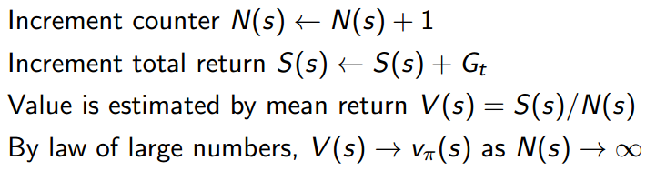
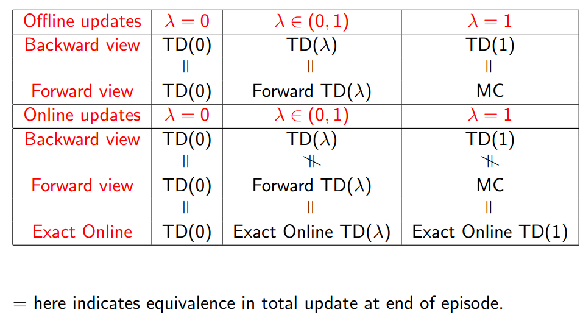

## Model-Free prediction

Estimate the value function of an unknown MDP，对应上一章的**预测**问题，只不过在本章中我们不清楚MDP的具体内容。

[TOC]

### Monte-Carlo Reinforcement Learning

**蒙特卡洛强化学习**指：在不清楚MDP状态转移及即时奖励的情况下，直接从经历完整的Episode来学习状态价值，通常情况下某状态的价值等于在多个Episode中以该状态算得到的所有收获的平均。

**基本思想**是 value = mean return，即用平均收获描述价值，理论上Episode越多，结果越准确。

**完整的Episode** 指必须从某一个状态开始，Agent与Environment交互直到**终止状态**，环境给出终止状态的即时收获为止。

**目标**：在给定策略$\pi $下，从一系列的完整Episode中学习得到该策略下的状态价值函数$v_\pi$。

在状态转移过程中，可能发生一个状态经过一定的转移后又一次或多次返回该状态，此时在一个Episode里如何计算这个状态发生的次数和计算该Episode的收获呢？可以有如下两种方法：

#### First-Visit Monte-Carlo Policy Evaluation

在给定一个策略，使用一系列完整Episode评估某一个状态s时，对于每一个Episode，仅当该状态**第一次**出现时列入计算:

#### Every-Visit Monte-Carlo Policy Evalustion

在给定一个策略，使用一系列完整Episode评估某一个状态s时，对于每一个Episode，状态s**每次**出现在状态转移链时，计算的具体公式与上面的一样，但具体意义不一样。

#### 累进更新平均值 Incremental Mean

在计算平均收获时不需要存储所有既往收获，而是每得到一次收获，就计算其平均收获。公式如下：
$$
\mu_k=\frac{1}{k}\sum_{j=1}^k x_j=\frac{1}{k}\left(x_k+\sum_{j=1}^{k-1}x_j\right)=\frac{1}{k}(x_k+(k-1)\mu_{k-1})=\mu_{k-1}+\frac{1}{k}(x_k-\mu_{k-1})
$$
把这个方法应用于蒙特卡洛策略评估，就得到下面的蒙特卡洛累进更新.

#### 蒙特卡洛累进更新 Incremental Monte-Carlo Updates

在得到一个完整的Episode（$S_1,A_1,R_2,\dots,S_T$）后更新$V(s)$

也可以引入参数$\alpha$代替上面的$\frac{1}{N(S_t)}$
$$
V(S_t)\leftarrow V(S_t)+\alpha(G_t-V(S_t))
$$

### Temporal-Difference Learning

时序差分学习简称TD学习，它的特点如下：和蒙特卡洛学习一样，它也从Episode学习，不需要了解模型本身；但是它可以学习**不完整**的Episode，通过自举（bootstrapping），猜测Episode的结果，同时持续更新这个猜测。

#### Simplest temporal-difference learning algorithm ：TD(0)

**Bootstrapping**指的就是TD target代替return的过程

#### 对比MC和TD

- TD 在知道结果之前可以学习，MC必须等到最后结果才能学习；TD 可以在没有结果时学习，可以在持续进行的环境里学习。

- $G_t$是对某一策略状态价值的**无偏**估计；True TD target（$R_{t+1}+\gamma v_\pi (S_{t+1})$）是基于下一状态的**实际**价值对当前状态实际价值的无偏估计；TD target（$R_{t+1}+\gamma V(S_{t+1})$）是基于下一状态**预估**价值计算的当前预估收获，是当前状态实际价值的**有偏**估计

  MC算法试图收敛至一个能够最小化状态价值与实际收获的均方差的解决方案，这一均方差用公式表示为：
  $$
  \sum_{k=1}^K\sum_{t=1}^{T_k}(G_t^k-V(s_t^k))^2
  $$
  TD算法则收敛至一个根据已有经验构建的最大可能的马儿可夫模型的状态价值，也就是说TD算法将首先根据已有经验估计状态间的转移概率，同时估计某一状态的即时奖励。

  

  通过AB例子理解二者的区别

  

  显然$V(B)=6/8=0.75$，重点在于如何求解$V(A)$.应用MC算法，由于需要完整的Episode,因此仅Episode1可以用来计算A的状态价值，很明显是0；同时B的价值是6/8。应用TD算法时，TD算法试图利用现有的Episode经验构建一个MDP（如下图），由于存在一个Episode使得状态A有后继状态B，因此状态A的价值是通过状态B的价值来计算的，同时经验表明A到B的转移概率是100%，且A状态的即时奖励是0，并且没有衰减，因此A的状态价值等于B的状态价值.可以这样认为，尽管MDP是未知的，TD算法仍会根据数据去拟合出MDP模型，如下图：

  

- 通过比较可以看出，TD算法使用了MDP问题的马儿可夫属性，在Markov 环境下更有效；但是MC算法并不利用马儿可夫属性，通常在非Markov环境下更有效。

#### 小结：对比MC、TD和DP

### TD(λ)

TD(0)只做了1步预测，也就是说在当前状态多看了一步，即TD target为$R_{t+1}+\gamma V(S_{t+1}) $，要是往前多看几步呢？也就是n-Step Prediction，对应n-Step TD

#### n-Step TD

定义n-step return为

n-step TD learning中状态价值函数更新公式为

当n=1时，对应TD(0)（也可以叫做TD），当$n\rightarrow\infty$时，对应MC算法。可见，n-step TD将MC和TD统一起来，意味着存在将MC和TD结合起来的可能性。

通过引入$\lambda $这个新的参数，可以做到在不增加计算复杂度的情况下综合考虑所有步数的预测。这就是**λ预测**和**λ收获**

#### λ-return

应用几何权重$(1-\lambda)\lambda^{n-1} $，$\lambda $-return为

$$
G_t^\lambda=(1-\lambda)\sum\limits_{n=1}^\infty\lambda^{n-1}G_t^{(n)}
$$

|                                                              |                                                              |
| ------------------------------------------------------------ | ------------------------------------------------------------ |
|  |  |

#### Forward-view TD(λ)

使用λ-return更新状态价值函数；通过看向未来（用状态$S_t$以后的数据）计算λ-return；必须要走完整个Episode（离线更新）获得每一个状态的即时奖励以及最终状态获得的即时奖励。这和MC算法的要求一样，因此TD(λ)算法有着和MC方法一样的劣势。λ取值区间为[0,1]，当λ=1时对应的就是MC算法。

#### Backward View TD(λ)

TD(λ)从另一方面提供了一个单步更新的机制：可以在线更新、一步一更新、可以利用不完整的Episode

***效用追踪 Eligibility Traces***(ET)

- **频率启发 Frequency heuristic：**将原因归因于出现频率最高的状态
- **就近启发 Recency heuristic：**将原因归因于较近的几次状态

ET将两种启发结合起来：
$$
E_0(s)=0\\E_t(s)=\gamma\lambda E_{t-1}(s)+\boldsymbol{1}(S_t=s)
$$
$V(s)$的更新公式如下：
$$
V(s)\leftarrow V(s)+\alpha\delta_t E_t(s)
$$
其中的$\delta_t$也就是上文TD learning中所说的TD error，$\delta_t=R_{t+1}+\gamma V(S_{t+1})-V(S_t)$

$E_t(s)$随时间变化的曲线可能像下图所示（每个状态有对应的E值函数）：

该图横坐标是时间，横坐标下有竖线的位置代表当前进入了状态s，纵坐标是效用追踪值E。可以看出当某一状态连续出现，E值会在一定衰减的基础上有一个单位数值的提高，此时将增加该状态对于最终收获贡献的比重，因而在更新该状态价值的时候可以较多地考虑最终收获的影响。同时如果该状态距离最终状态较远，则其对最终收获的贡献越小，在更新该状态时也不需要太多的考虑最终收获。并且E值不需要等到完整的Episode结束才能计算出来，每经过一个时刻就可以更新E值。ET是一个非常符合神经科学相关理论的、非常精巧的设计。把它看成是神经元的一个参数，它反映了神经元对某一刺激的敏感性和适应性。神经元在接受刺激时会有反馈，在持续刺激时反馈一般也比较强，当间歇一段时间不刺激时，神经元又逐渐趋于静息状态；同时不论如何增加刺激的频率，神经元有一个最大饱和反馈。同样的，E值也有瞬时最高上限：$E_{max}=1/(1-\gamma\lambda)$

#### TD(λ)和TD(0)

当λ=0时，只有当前状态得到更新，等同于TD(0)算法

#### TD(λ)和MC

当λ=1时，TD(1)粗略看与**每次访问（Every-visit）**的MC算法等同；离线更新时，TD(1)等同于MC算法；在线更新时，每一步都会更新状态价值，在经历一个完整的Episode后，TD(1)更新的累计结果和MC的更新结果是一致的。TD(1)每步都会更新，而MC是在一个完整的Episode结束时才更新。

#### 定理

对于forward-view TD(λ)和backward-view TD(λ)而言，**离线更新**的**总和**是相等的

#### 小结

