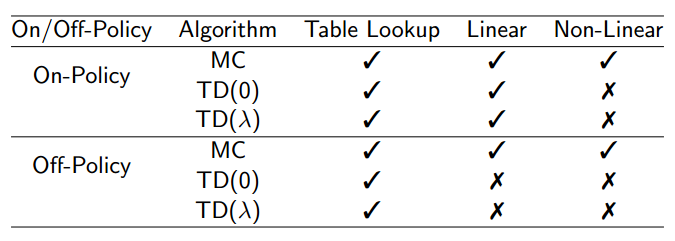

## Value Function Approximation  

价值函数需要用一张大表来存储，获取某一状态或行为价值的时候通常需要一个查表操作（Table Lookup），这对于那些状态空间或行为空间很大的问题几乎无法求解，而许多实际问题都是这些拥有大量状态和行为空间的问题。**本讲**主要解决**各种价值函数的近似表示和学习**，**下一讲**则主要集中**与策略相关的近似表示和学习**。

Types of Value Function Approximation ：

- 针对状态本身，输出这个状态的近似价值；

- 针对状态行为对，输出状态行为对的近似价值；

- 针对状态本身，输出一个向量，向量中的每一个元素是该状态下采取一种可能行为的价值。

几种近似方法：

- **特征向量线性组合（Linear combinations of features）**
- **神经网络（Neural network）**
- 决策树（Decision tree）
- 邻近算法（Nearest neighbor）
- 基于傅里叶/小波变换（Fourier/wavelet  bases）

另外还需要一种适用于**非静态(non-stationary)**和**非独立同分布(non-i.i.d)**数据的训练方法

### Incremental Methods

#### Gradient Descent梯度下降

假设$J(\bold{w})$是关于$\bold{w}$的**可微函数**，那么$J(w)$的梯度定义为
$$
\nabla_\bold{w}J(\bold{w})=\begin{pmatrix}\frac{\partial J(\bold{w})}{\part \bold{w_1}}\\\vdots\\\frac{\part J(\bold{w})}{\part\bold{w_n}}\end{pmatrix}
$$
朝着负梯度的方向调整参数，寻找$J(\bold{w})$的局部最小值
$$
\Delta \bold{w}=-\frac{1}{2}\alpha\nabla_\bold{w}J(\bold{w})
$$

**随机梯度下降的思想在于随机采样一个样本用以更新参数** 

tricky的地方在于，实际上我们不知道$v_\pi(S)$的真值，真正应用的时候是用MC和TD等方法估计$v_\pi(s)$。

#### Example: Linear Value Function Approximation (using SGD)

假设$\hat{v}(S,\bold{w})=\bold{x}(S)^T\bold{w}=\sum\limits_{j=1}^n\bold{x}_j(S)\bold{w}_j$，其中$\bold{x}(S)=(\bold{x_1}(S),\dots,\bold{x_n}(S))^T$，表示一组特征向量，那么
$$
J(\bold{w})=\mathbb{E}_\pi\left[(v_\pi(S)-\bold{x}(S)^T\bold{w})^2\right]
$$
这里$\hat{v}(S,\bold{w})$的梯度比较简单，$\nabla_\bold{w}\hat{v}(S,\bold{w})=\bold{x}(S)$，于是，参数更新规则也十分简单：
$$
\Delta\bold{w}=\alpha(v_\pi(S)-\hat{v}(S,\bold{w}))\bold{x}(S)
$$
实际上就是步长×预测误差×特征值

#### Incremental **Prediction** Algorithms

#### Control with Value Function Approximation

从一系列参数开始，得到一个近似的状态行为对价值函数，在Ɛ-greedy执行策略下产生一个行为，执行该行为得到一个即时奖励，以此数据计算目标值，进行近似函数参数的更新。再应用这个策略得到后续的状态和对应的目标值，每经历一次状态就更新依次参数，如此反复进行策略的优化，同时逼近最优价值函数。

此时近似的对象不再是状态价值函数$v_\pi$，而是行为价值函数$q_\pi(S,A)$，即$\hat{q}(S,A,\bold{w})\approx q_\pi(S,A)$.
$$
J(\bold{w})=\mathbb{E}_\pi\left[(q_\pi(S,A)-\hat{q}(S,A,\bold{w}))^2\right]
$$
若使用SGD寻找局部最优，则
$$
\Delta\bold{w}=-\frac{1}{2}\alpha\nabla_\bold{w}J(\bold{w})=\alpha(q_\pi(S,A)-\hat{q}(S,A,\bold{w}))\nabla_\bold{w}\hat{q}(S,A,\bold{w})
$$
但在实际应用中，$q_\pi(S,A)$的真值我们是无法得知的，需要用MC、TD等方法估计。

MC使用的是实际价值的有噪声无偏估计，虽然很多时候表现很差，但总能收敛至局部或全局最优解。TD性能通常更加优秀，但无法保证TD总是收敛的。下表罗列了几种方法适用的问题（打钩表示收敛)：

### Batch Methods

前面所说的Incremental Methods都是基于数据流的，经历一步，更新算法后，我们就不再使用这步的数据了，这种算法简单，但有时候不够高效。与之相反，Batch Methods则是把一段时期内的数据集中起来，通过学习来使得参数能较好地符合这段时期内所有的数据。这种思想称为“Experience Replay”

#### Least Squares Prediction

假设存在$\hat{v}(s,\bold{w})\approx v_\pi(s)$，以及一段由**状态价值对**构成的经历$\mathcal{D}$（$\mathcal{D}=\left\{\left<s_1,v_1^\pi\right>,\dots,\left<s_T,v_T^\pi\right>\right\}$），找到最合适的参数$\bold{w}$使得下式最小（最小二乘）：
$$
LS(\bold{w})=\sum_{t=1}^T(v_t^\pi-\hat{v}(s_t,\bold{w}))^2=\mathbb{E}_\mathcal{D}[(v^\pi-\hat{v}(s,\bold{w}))^2]
$$
采用SGD解决该问题，重复以下操作：

- 从经历$\mathcal{D}$中采样，获得$\left<s,v^\pi\right>\sim\mathcal{D}$；
- 应用SGD算法更新参数，$\Delta\bold{w}=\alpha(v^\pi-\hat{v}(s,\bold{w}))\nabla_\bold{w}\hat{v}(s,\bold{w})$.

最终将收敛到最小二乘解，即$\bold{w}^\pi\rightarrow \arg\min\limits_{\bold{w}}LS(\bold{w})$.

如果结合linear value function approximation，也就是令$\hat{v}(s,\bold{w})=\bold{x}(s)^T\bold{w}$的话，那么可以直接求解出最小二乘解：为了让参数收敛，最终一定会有$\mathbb{E}_\mathcal{D}[\Delta\bold{w}]=0$，也就是

$$
\begin{align*}
\alpha\sum\limits_{t=1}^T\bold{x}(s_t)(v_t^\pi-\bold{x}(s_t)^T\bold{w})&=0\\
\Rightarrow\bold{w}&=\left(\sum_{t=1}^T\bold{x}(s_t)\bold{x}(s_t)^T\right)^{-1}\sum_{t=1}^T\bold{x}(s_t)v_t^\pi
\end{align*}
$$

当选择的特征向量维数不大时，可以考虑采用这种方法。同样的，由于$v_t^\pi$的真值我们无法获取，只能用MC、TD等方法进行估计。

